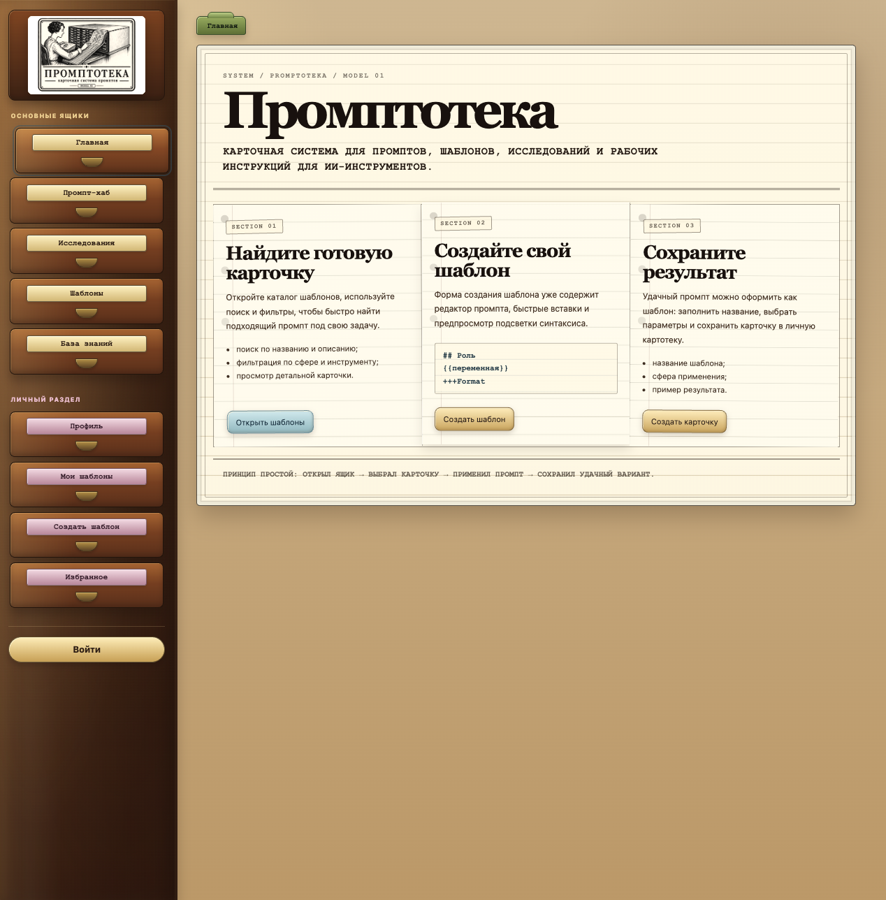

# Промптотека



**Промптотека** - учебный веб-проект по дисциплине «Разработка интерфейса пользователя». Это небольшая картотека промптов для ИИ-инструментов: 
- пользователь может искать готовые шаблоны; 
- читать практические заметки; 
- смотреть краткие выводы из исследований; 
- создавать свои карточки промптов.

Визуальный стиль проекта - **скевоморфизм**. Это подход, при котором цифровой интерфейс напоминает реальные предметы: бумагу, карточки, ящики, вкладки, наклейки и старые рабочие бланки.

Для «Промптотеки» я выбрал образ старой картотеки. Поэтому меню выглядит как деревянный шкаф с ящиками, разделы оформлены как бумажные карточки, а хлебные крошки похожи на цветные разделители. Такой стиль помогает сделать интерфейс не просто набором страниц, а единой рабочей системой, где пользователь будто разбирает и собирает карточки с промптами.

## Что реализовано

| Раздел | Статус | Что сделано |
|:--|:--:|:--|
| Главная | ✅ | Короткая инструкция по работе с Промптотекой и адаптивный бумажный разворот |
| Промпт-хаб | ✅ | Публичный каталог промптов со списком карточек, поиском, копированием и избранным |
| Шаблоны | ✅ | Каталог шаблонов с поиском, фильтрацией, копированием и переходом в карточку |
| Карточка шаблона | ✅ | Просмотр промпта, результата, параметров, лайков, копирования и избранного |
| Создание шаблона | ✅ | Форма добавления собственной карточки промпта |
| Редактор промпта | ✅ | Быстрые кнопки, копирование текста и детальная подсветка структуры промпта |
| Исследования | ✅ | Карточки с краткими выводами по промпт-инжинирингу |
| База знаний | ✅ | Практические заметки по оформлению промптов |
| Авторизация | ✅ | Вход, регистрация и восстановление пароля |
| Личный кабинет | 🟡 | Прототип личного рабочего места пользователя |
| Избранное | ✅ | Личная полка с сохранёнными чужими промптами |
| Лайки | ✅ | Простая система оценки шаблонов |
| Адаптивность | ✅ | Поддержка маленьких мобильных экранов, планшетов, ПК и широких 2K-разрешений |

## Основной функционал

### Каталог шаблонов

Готовые шаблоны промптов можно искать по названию, сфере применения, инструменту и типу задачи. Поиск сохраняется в адресной строке, поэтому к результатам можно вернуться позже.

Что есть в каталоге:

- поиск по тексту;
- фильтр по сфере;
- фильтр по инструменту;
- фильтр по типу задачи;
- карточки найденных шаблонов;
- переход в подробную карточку шаблона.

### Карточка шаблона

В карточке шаблона показаны:

- название;
- описание;
- сфера применения;
- инструмент;
- тип задачи;
- текст промпта;
- пример результата;
- кнопка копирования промпта;
- лайк шаблона.

### Создание шаблона

Пользователь может собрать собственную карточку промпта: добавить название, сферу, инструмент, текст промпта и пример результата. Редактор помогает быстрее оформить структуру и сразу показывает подсветку.

### База знаний

Короткие практические заметки о том, как оформлять промпты: структура, разделители, переменные, JSON, XML, примеры и проверка результата.

### Исследования

Короткие выжимки из исследований о промптах: какая техника изучалась, какой вывод можно сделать и как применить это при создании своих шаблонов.

## Что использовалось при проектировании интерфейса

При проектировании я опирался на материалы курса по UX/UI, формам, интеграции дизайна и вёрстки, тестированию и доступности.

| Принцип | Как применён в проекте |
|:--|:--|
| Единая визуальная метафора | Весь интерфейс построен вокруг идеи картотеки |
| Понятная навигация | Основные разделы вынесены в левое меню в виде ящиков |
| Фокус на главном | На страницах нет лишних блоков, основные действия выделены кнопками |
| Состояния интерфейса | Есть активные пункты меню, hover-эффекты и focus-состояния |
| Читаемость | Карточки, формы и тексты разделены визуально |
| Адаптивность | Интерфейс подстраивается под desktop, tablet и mobile |
| Доступность | Используются `label`, `aria-label`, `focus-visible`, понятные названия кнопок |
| Валидация | Ошибки форм показываются рядом с конкретными полями |

---

## Стек

| Технология | Для чего использовалась |
|:--|:--|
| React | Компоненты интерфейса |
| Vite | Сборка и запуск проекта |
| React Router | Маршруты между страницами |
| CSS | Визуальный стиль и адаптивная вёрстка |
| Vitest | Unit и integration тесты |
| React Testing Library | Проверка компонентов |
| Playwright | E2E-тест основного сценария |

>  Данные в проекте пока на mockах, без настоящего бэкенда. 

## Lighthouse

Проект проверен через Lighthouse в production-режиме Vite.

Проверка выполнялась после команд:

```bash
npm run build
npm run preview
```
Результаты аудита сохранены в папке:

```text
docs/lighthouse/
```


## Запуск проекта

### 1. Установить зависимости

```bash
npm install
```

### 2. Запустить проект

```bash
npm run dev
```

После запуска Vite покажет локальный адрес. Обычно это:

```text
http://localhost:5173
```

## Проверка проекта

### Unit и integration тесты

```bash
npm run test
```

### E2E-тест через Playwright

```bash
npm run test:e2e
```

### Production-сборка

```bash
npm run build
```

> Если все команды проходят без ошибок, значит проект собирается и основные сценарии работают.

## Что проверяют тесты

| Тип проверки | Что проверяется |
|:--|:--|
| Unit | Валидация форм, поиск, фильтрация, подсветка синтаксиса |
| Integration | Работа редактора промптов |
| E2E | Основной пользовательский сценарий через браузер |
| Build | Возможность собрать проект для production |

---

## Структура проекта

```text
src/
├── assets/              # изображения и статичные файлы
├── components/          # переиспользуемые компоненты
│   ├── editor/          # редактор промпта и предпросмотр подсветки
│   ├── forms/           # формы авторизации и создания шаблона
│   └── templates/       # каталог и карточки шаблонов
├── data/                # mock-данные для шаблонов, базы знаний и исследований
├── pages/               # отдельные страницы проекта
├── utils/               # функции валидации, поиска и фильтрации
├── App.jsx              # маршруты и основная структура приложения
└── index.css            # общий CSS проекта

е2e/                     # E2E-тесты Playwright
```

---

## Основные файлы

| Файл | За что отвечает |
|:--|:--|
| `src/App.jsx` | Маршруты, боковое меню, хлебные крошки и основные страницы |
| `src/index.css` | Общий визуальный стиль проекта |
| `src/data/demoTemplates.js` | Mock-данные шаблонов |
| `src/data/knowledgeArticles.js` | Статьи базы знаний |
| `src/data/researchArticles.js` | Карточки исследований |
| `src/components/forms/TemplateCreationForm.jsx` | Форма создания шаблона |
| `src/components/editor/PromptEditor.jsx` | Редактор промпта |
| `src/components/templates/TemplateCatalog.jsx` | Каталог и карточка шаблона |
| `src/pages/KnowledgeBasePage.jsx` | База знаний |
| `src/pages/ResearchPage.jsx` | Раздел исследований |

## Пользовательский сценарий

Один из основных сценариев выглядит так:

1. Пользователь открывает главную страницу.
2. Переходит в раздел «Шаблоны».
3. Ищет подходящий шаблон через поиск или фильтры.
4. Открывает карточку шаблона.
5. Копирует промпт или ставит лайк.
6. Переходит к созданию своего шаблона.
7. Заполняет форму и проверяет подсветку в редакторе.

>Этот сценарий дополнительно проверяется через E2E-тест.

