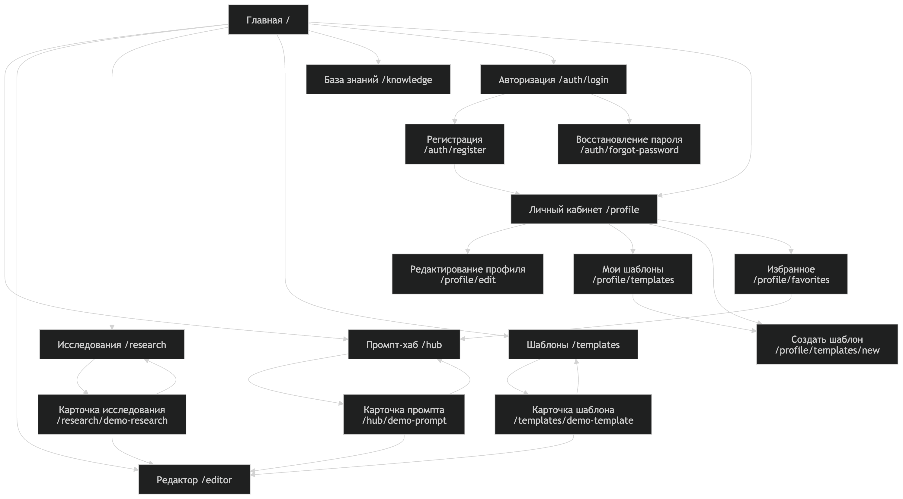

## Домашнее задание 2

Выполнена заготовка проекта:

- создан репозиторий GitHub;
- инициализировано React-приложение через Vite;
- создана информационная архитектура проекта;
- описана навигация;
- реализованы базовые маршруты;
- добавлены пустые страницы без наполнения контентом;
- добавлены `Header`, `Sidebar`, `Breadcrumbs`, `Footer`;
- подготовлена базовая визуальная концепция в духе светлого скевоморфизма.


## Информационная архитектура

### 1. Дерево страниц

```text
Промптотека
├── Главная /
│
├── Промпт-хаб /hub
│   ├── Каталог промптов /hub
│   └── Карточка промпта /hub/demo-prompt
│
├── Редактор промптов /editor
│
├── Исследования /research
│   ├── Список исследований /research
│   └── Карточка исследования /research/demo-research
│
├── Шаблоны /templates
│   ├── Готовые шаблоны /templates
│   └── Карточка шаблона /templates/demo-template
│
├── Авторизация /auth
│   ├── Вход /auth/login
│   ├── Регистрация /auth/register
│   └── Восстановление пароля /auth/forgot-password
│
├── Личный кабинет /profile
│   ├── Профиль /profile
│   ├── Редактирование профиля /profile/edit
│   ├── Мои шаблоны /profile/templates
│   ├── Создать шаблон /profile/templates/new
│   └── Избранное /profile/favorites
│
├── База знаний /knowledge
│
└── Страница 404 /*
```

## Mermaid-диаграмма карты сайта



### 2. Компонентная структура навигации

```text
App
├── Header
│   ├── Logo
│   ├── MainNavigation
│   └── UserNavigation
│
├── Sidebar
│   ├── Основные разделы
│   └── Личный раздел
│
├── Main
│   ├── Breadcrumbs
│   └── Routes
│
└── Footer
    └── FooterNavigation
```

### 2.1 Компонентная структура навигации

| Компонент | Где находится | Тип навигации | Что содержит | Зачем нужен |
|---|---|---|---|---|
| `Header` | Верхняя часть страницы | Статическая | Логотип, основные разделы, вход | Даёт быстрый переход к главным разделам проекта |
| `Sidebar` | Левая часть интерфейса | Статическая + частично контекстная | Основные разделы и личный раздел | Показывает «ящики» картотеки и помогает быстро перемещаться по приложению |
| `Breadcrumbs` | Над содержимым страницы | Динамическая | Цепочка текущего маршрута | Показывает, где пользователь находится сейчас |
| `Main` | Центральная область страницы | Зависит от маршрута | Текущая страница из `Routes` | Отображает выбранный раздел приложения |
| `Footer` | Нижняя часть страницы | Статическая | Служебные ссылки | Даёт дополнительные переходы и помогает избежать «мёртвых концов» |

### 2.2 Детализация навигационных компонентов

| Компонент | Элементы | Тип | Описание |
|---|---|---|---|
| `Header` | Промпт-хаб | Статическая | Переход в публичный каталог промптов |
| `Header` | Редактор | Статическая | Переход в редактор промптов |
| `Header` | Исследования | Статическая | Переход в базу исследований |
| `Header` | Шаблоны | Статическая | Переход к готовым шаблонам |
| `Header` | Войти | Статическая | Переход на страницу авторизации |


| Компонент | Элементы | Тип | Описание |
|---|---|---|---|
| `Sidebar` | Главная | Статическая | Возврат на стартовую страницу |
| `Sidebar` | Промпт-хаб | Статическая | Переход в каталог публичных промптов |
| `Sidebar` | Редактор | Статическая | Переход в редактор промптов |
| `Sidebar` | Исследования | Статическая | Переход к исследованиям |
| `Sidebar` | Шаблоны | Статическая | Переход к готовым шаблонам |
| `Sidebar` | База знаний | Статическая | Переход к учебным материалам |
| `Sidebar` | Профиль | Частично контекстная | Переход в личный кабинет |
| `Sidebar` | Мои шаблоны | Частично контекстная | Переход к шаблонам пользователя |
| `Sidebar` | Создать шаблон | Частично контекстная | Переход к созданию своего шаблона |
| `Sidebar` | Избранное | Частично контекстная | Переход к сохранённым шаблонам |


| Компонент | Пример маршрута | Что показывает |
|---|---|---|
| `Breadcrumbs` | `/` | Главная |
| `Breadcrumbs` | `/hub/demo-prompt` | Главная / Промпт-хаб / Карточка промпта |
| `Breadcrumbs` | `/research/demo-research` | Главная / Исследования / Карточка исследования |
| `Breadcrumbs` | `/profile/templates/new` | Главная / Личный кабинет / Мои шаблоны / Создать шаблон |


| Компонент | Элементы | Тип | Описание |
|---|---|---|---|
| `Footer` | База знаний | Статическая | Дополнительный переход к учебным материалам |
| `Footer` | Исследования | Статическая | Дополнительный переход к исследованиям |
| `Footer` | Промпт-хаб | Статическая | Дополнительный переход к каталогу промптов |


### 3. UX-сценарии

| № | Сценарий | Шаги пользователя | Что проверяем |
|---|---|---|---|
| 1 | Новый пользователь ищет промпт | Открывает главную → переходит в промпт-хаб → открывает карточку промпта → переходит в редактор | Пользователь может найти промпт и перейти к его использованию |
| 2 | Пользователь создаёт свой шаблон | Открывает личный кабинет → переходит в «Мои шаблоны» → нажимает «Создать шаблон» → открывает редактор или возвращается назад | У пользователя есть понятный путь к созданию собственного шаблона |
| 3 | Пользователь изучает исследование | Открывает исследования → переходит в карточку исследования → читает описание → переходит в редактор | Исследования не являются тупиковой страницей и ведут к практике |


## 3.1 Проверка мёртвых концов

| Страница | Возможный риск | Как исправлено в проекте |
|---|---|---|
| Карточка промпта | Пользователь прочитал промпт и не знает, что делать дальше | Добавлены переходы «Назад в каталог» и «Открыть в редакторе» |
| Карточка исследования | Пользователь прочитал исследование и оказался в тупике | Добавлены переходы «Назад к исследованиям» и «Применить в редакторе» |
| Карточка шаблона | Пользователь открыл шаблон, но не может продолжить работу | Добавлены переходы «Назад к шаблонам» и «Открыть в редакторе» |
| Избранное | Раздел может быть пустым | Добавлен переход в промпт-хаб |
| Мои шаблоны | У пользователя может не быть своих шаблонов | Добавлен переход к созданию шаблона |
| 404 | Пользователь попал на несуществующую страницу | Добавлены переходы на главную и в промпт-хаб |


### Доступные маршруты

| Маршрут | Назначение |
|---|---|
| `/` | Главная страница |
| `/hub` | Промпт-хаб |
| `/hub/demo-prompt` | Карточка промпта |
| `/editor` | Редактор промптов |
| `/research` | Список исследований |
| `/research/demo-research` | Карточка исследования |
| `/templates` | Список шаблонов |
| `/templates/demo-template` | Карточка шаблона |
| `/knowledge` | База знаний |
| `/auth/login` | Вход |
| `/auth/register` | Регистрация |
| `/auth/forgot-password` | Восстановление пароля |
| `/profile` | Личный кабинет |
| `/profile/edit` | Редактирование профиля |
| `/profile/templates` | Мои шаблоны |
| `/profile/templates/new` | Создать шаблон |
| `/profile/favorites` | Избранное |


## Запуск проекта

1) Установить зависимости:

```bash
npm install
```

2) Запустить проект:

```bash
npm run dev
```

3) Открыть в браузере:

```bash
http://localhost:5173/
```